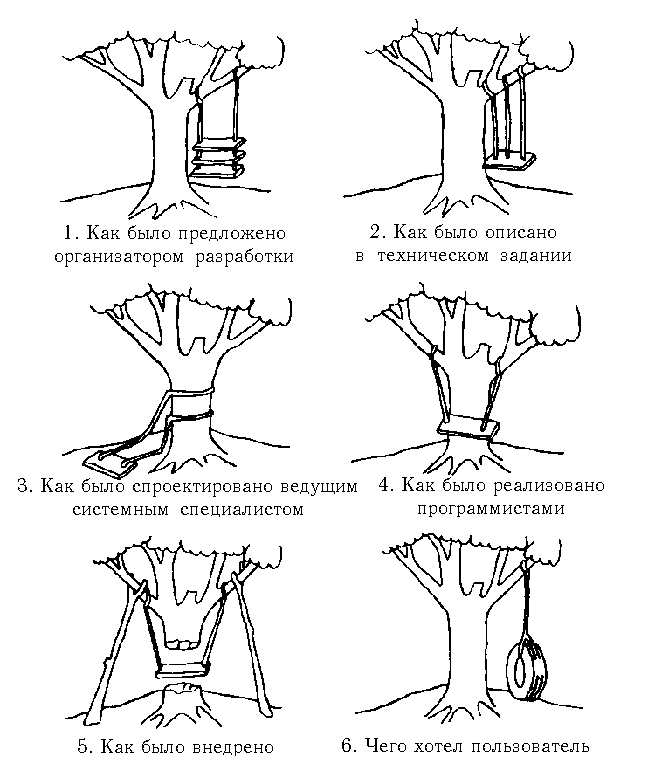

# Основные команды Git для работы с удаленным репозиторием

Клонирование внешнего репозитория на локальный ПК.
```
git clone <url-адрес репозитория>
```

Отправить изменения на удаленный репозиторий. *Выполняется после создания коммита*
```
git push
```

Скачать изменения из удаленного репозитория на локальный *(смержить их с локальной версией)*
```
git pull
```

