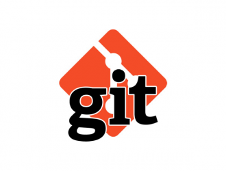

# Подсказка по GIT




Git — абсолютный лидер по популярности среди современных систем управления версиями. Это развитый проект с активной поддержкой и открытым исходным кодом. Система Git была изначально разработана в 2005 году Линусом Торвальдсом — создателем ядра операционной системы Linux. Git применяется для управления версиями в рамках колоссального количества проектов по разработке ПО, как коммерческих, так и с открытым исходным кодом. Система используется множеством профессиональных разработчиков программного обеспечения. Она превосходно работает под управлением различных операционных систем и может применяться со множеством интегрированных сред разработки (IDE).


Git — система управления версиями с распределенной архитектурой. В отличие от некогда популярных систем вроде CVS и Subversion (SVN), где полная история версий проекта доступна лишь в одном месте, в Git каждая рабочая копия кода сама по себе является репозиторием. Это позволяет всем разработчикам хранить историю изменений в полном объеме.


Разработка в Git ориентирована на обеспечение высокой производительности, безопасности и гибкости распределенной системы.

---

[Информация о GIT, возможность скачать дистрибутив ](https://git-scm.com/ "О GIT")

---

# Основные команды в Git
## git init

* Создание репозитория (инициализирует новый репозиторий Git в текущей папке):
```sh
git init
```
---
## git status
* Отображение состояния рабочего каталога и раздела проиндексированных файлов. С ее помощью можно проверить индексацию изменений и увидеть файлы, которые не отслеживаются Git:
```sh
git status
```
---
## git add и git commit
* Добавление изменений, произошедших с определенным файлом, в индекс:
```sh
git add <file_name>
```
---
* Фиксирование изменений в репозитории с добавлением комментария:
```sh
git commit -m "Message text"
```
---
## git rm и git mv
* Используется для удаления файлов из индекса и рабочей директории. Она похожа на git add с тем исключением, что она удаляет, а не добавляет файлы для следующего коммита:
```sh
git rm <file_name>
```
---

* Используется для удаления файла только из индекса, сохраняя его в рабочем каталоге. Это полезно, если нужно перестать отслеживать файл (например, добавить его в .gitignore), но не нужно физически удалять его из файловой системы:
```sh
git rm --cached <file_name>
```
---

* git mv - команда для перемещения или переименования файлов и обновления индекса git. Т.е. эта команда по сути эквивалентна запуску git rm в исходном файле, а затем запуску git add в новом файле.

Важно отметить, что эта команда работает только в локальном репозитории. Если нужно переместить файлы в удаленный репозиторий, необходимо использовать такие команды, как git rm и git add отдельно.

Переместить файл в репозиторий и добавить перемещение в следующий коммит:
```sh
git mv <path/to/file> <new/path/to/file>
```

Переименовать файл и добавить переименование в следующий коммит:
```sh
git mv <filename> <new_filename>
```

---
## git log
* Отображение отправленных снимков состояния с возможностью просматривать и фильтровать историю коммитов, а также искать в ней конкретные изменения:
```sh
git log
```
---
* Отображение истории коммитов в более сокращенном виде (на каждое изменение - одна строка; выводит короткий хэш по коммитам):
```sh
git log --oneline
```
---
* Отображение истории коммитов в более сокращенном виде (на каждое изменение - одна строка; выводит короткий хэш по коммитам), а также дополнительный вывод с помощью опции --graph небольшого графа в формате ASCII, который показывает текущую ветку и историю ветвлений и слияний:
```sh
git log --oneline --graph
```
---
## git diff
* Позволяет сравнивать источники данных git — коммиты, ветки, файлы. Для вывода изменений в файлах по сравнению с последним коммитом, используется git diff без параметров (Команда выводит изменения в файлах, которые еще не были добавлены в индекс. Сравнение происходит с последним коммитом):
```sh
git diff
```
---
* Позволяет сравнить два коммита. Для этого в качестве первого аргумента команде git diff указывается хеш первого коммита, а вторым аргументом - хеш второго коммита:
```sh
git diff <first_commit_hash> <second_commit_hash>
```
---
* Позволяет вывести все изменения между двумя ветками (их конечными состояниями на данный момент), необходимо для git diff указать имена веток:
```sh
git diff <first_branch_name> <second_branch_name>
```
---
## git checkout
* Позволяет перемещаться между зафиксированными состояниями в ветках. При переключении ветки происходит обновление файлов в рабочем каталоге в соответствии с версией, хранящейся в этой ветке, а Git начинает записывать все новые коммиты в этой ветке (Основная функция git checkout - это перемещать указатель HEAD, т.е. то куда смотрит локальная копия):
```sh
git checkout <branch_name>
```
---
## git branch
* Позволяет отобразить список всех веток в репозитории с указанием на то, какая ветка на данный момент выбрана (знак звездочки и выделение цветом). Это синоним команды git branch --list:
```sh
git branch
```
---
* Позволяет создать новую ветку с именем ＜branch_name＞. Эта команда не выполняет переключение на эту новую ветку (для этого используется git checkout):
```sh
git branch <branch_name>
```
---
* Позволяет выполнить удаление ветки с именем <branch_name>. Это «безопасная» операция, поскольку git не позволит удалить ветку, если в ней есть неслитые изменения:
```sh
git branch -d <branch_name>
```
---
* Позволяет выполнить принудительное удаление ветки с именем <branch_name>, даже если в ней есть неслитые изменения. Эта команда используется, если есть необходимость навсегда удалить все коммиты, связанные с определенным направлением разработки:
```sh
git branch -D <branch_name>
```
---
## git merge
* Позволяет выполнить слияние отдельных направлений разработки, т.е. веток, созданных с помощью команды git branch <branch_name>, в единую ветку. 
Команда git merge часто используется в сочетании с командами git checkout (для выбора текущей ветки) и git branch -d (для удаления устаревшей ветки):
```sh
git merge <branch_name>
```
---
---

# Основные команды в Git для работы с удаленными репозиториями
## git fetch и git pull

* Команда связывается с удаленным репозиторием и забирает из него все изменения, которых пока нет в локальном репозитории, и сохраняет их локально:
```sh
git fetch <remote_name>
```
---
* Команда работает как комбинация команд git fetch и git merge, т.е. git сначала забирает изменения из указанного удаленного репозитория, а затем пытается слить их с текущей веткой:
```sh
git pull <remote_name> <branch_name>
```
---
* Команда выполняет синхронизацию с репозиторием, используя перебазирование (применяется при разрешении конфликтов слияния):
```sh
git pull --rebase <remote_name> <branch_name>
```
Команда git rebase используется для перебазирования текущей ветки на другую ветку или на определенный коммит. Это означает, что изменения из исходной ветки будут применены поверх коммитов в целевой ветке или коммите. 

Когда выполняется pull-rebase, git пытается выяснить, какие коммиты есть только в локальной ветке, а какие - в удаленном репозитории. Затем git объединяет коммиты из удаленного репозитория с самым свежим коммитом, присутствующим и в локальном, и в удаленном репозитории. После чего выполняет rebase локальных коммитов в конец ветки.

Т.е. pull-rebase выполняет перебазирование текущей ветки на самый новый коммит вместо создания слияния (merge).

---
* Завершение перебазирования после разрешения конфликта слияния:
```sh
git rebase --continue
```
---
* Команда позволяет пропустить коммит, над которым ведется работа, и он не будет включен в перебазирование:
```sh
git rebase --skip
```

---
## git push

* Используется для установления связи с удаленным репозиторием, вычисления локальных изменений, отсутствующих в нем, и передачи локальных изменений в удаленный репозиторий. Этой команде нужно право на запись в репозиторий, поэтому она использует аутентификацию:
```sh
git push <remote_name> <branch_name>
```
---
* Если ветка, которую нужно отправить в удаленный репозиторий, еще не отслеживается, то нужно добавить ключ —set-upstream (или аналог - ключ -u).Команда устанавливает отслеживание для ветки, что позволяет в дальнейшем использовать git push и git pull без указания имени удаленного репозитория и названия ветки:
```sh
git push --set-upstream <remote_name> <new_branch_name>
```
---
## git remote

* Используется для управления списком удаленных репозиториев. Позволяет сохранять длинные URL репозиториев в виде понятных коротких строк, например "origin". Можно использовать несколько удаленных репозиториев для работы, и git remote поможет добавлять, изменять и удалять их.

 Запуск команды git remote позволяет просмотреть список настроенных удаленных репозиториев. Она выведет названия доступных удаленых репозиториев. Например, если было выполнено клонирование репозитория, то будет введено как минимум origin - имя по умолчанию, которое git дает серверу, с которого производилось клонирование:
```sh
git remote
```
---
* Можно указать ключ -v, чтобы просмотреть адреса для чтения (для такого адреса в скобках будет помечено fetch) и записи (для такого адреса в скобках будет помечено push), привязанные к репозиторию. Если в наличии больше одного удаленного репозитория, команда выведет их все:
```sh
git remote -v
```
---
* Добавление удаленного репозитория и присвоение ему короткого имени (shortname). После выполнения этой команды вместо указания полного пути можно будет использовать shortname:
```sh
git remote add <shortname> <url>
```
---
* Получение более подробной информации об указанном в <remote_name> удаленном репозитории. Она выводит URL удаленного репозитория (адреса для чтения, т.е. с пометкой fetch, и записи - с пометкой push), а также информацию об отслеживаемых ветках. Данная команда показывает, какая именно локальная ветка будет отправлена на удаленный сервер по умолчанию при выполнении git push. Она также может показывать, каких веток с удаленного сервера еще нет локально, какие ветки еще есть локально, но уже удалены на сервере, и для веток может быть показано, какие удаленные ветки будут в них влиты при выполнении git pull:
```sh
git remote show <remote_name>
```
---
* Используется для переименования удаленного репозитория:
```sh
git remote rename <old_remote_name> <new_remote_name>
```
---
* Используется для изменения адреса подключенного удаленного репозитория. В <new_url> указывается новый адрес:
```sh
git remote set-url <remote_name> <new_url>
```
---
* Используется для удаления удаленного репозитория. При удалении ссылки на удаленный репозиторий все отслеживаемые ветки и настройки, связанные с этим репозиторием, так же будут удалены:
```sh
git remote rm <remote_name>
```


---
## git clone 

*  Используется для создания локальной копии удаленного репозитория. Исходный репозиторий может находиться в локальной файловой системе или на удаленном устройстве.
```sh
git clone <url>
```
В действительности git clone работает как обертка над некоторыми другими командами. Она создает новый каталог, переходит внутрь и выполняет git init для создания пустого репозитория, затем она добавляет новый удаленный репозиторий (git remote add) для указанного URL (по умолчанию он получит имя origin), выполняет git fetch для этого репозитория и, наконец, извлекает последний коммит в рабочий каталог, используя git checkout.

---
---