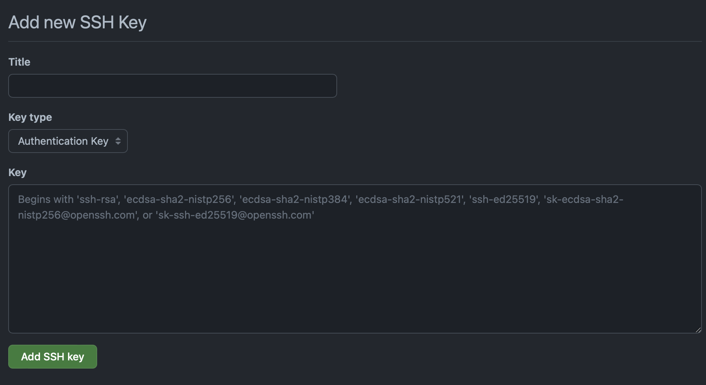

# <font color=gray>GIT</font>


<font color=gray>git repo servers</font>
* [github](https://github.com "GitHub git repo server")
* [gitlab](https://about.gitlab.com "GitLab git repo server")
* [bitbucket](https://bitbucket.org "BitBucket git repo server")

## <font color=gray>Что такое git?</font>

***Git*** - cистема контроля версий.

Основные тезисы:
* Безопасность <br> Сохранение на каждом этапе работы с возможностью отката до рабочей версии.
* Доступность <br> Работа команды над одним проектом параллельно.

Концепция:
* __remote git repository__ (удаленный репозиторий)
* __local git repository__ (локальная версия репозитория)
* __history__ (история модификации проекта)
* __staging__ (изменения фиксируемые локально __change to commit__)
* __Staging area__ промежуточное состояние __work directory -> staging area -> local repository__ (файлы помещаются в нее командой git'a - git add)
* __git client__ управление git'ом (терминальная версия cli - command line interface)

## <font color=gray>Начало работы.</font>
__Установка git__<br>

***Windows:***<br>
[Windows 7 x64](https://github.com/git-for-windows/git/releases/download/v2.43.0.windows.1/Git-2.43.0-64-bit.exe)<br>
[Windows 7 x32](https://github.com/git-for-windows/git/releases/download/v2.43.0.windows.1/Git-2.43.0-32-bit.exe)<br>

***MacOS:***<br>
Установка менеджера пакетов homebrew<br>
```
/bin/bash -c "$(curl -fsSL https://raw.githubusercontent.com/Homebrew/install/HEAD/install.sh)"
```
Установка git-cli<br>
```
brew install git
```
Установка git-gui (с графическим интерфейсом)<br>
```
brew install git-gui
```
__Настройка git__<br>
Вместо name и email указываем свое имя и эл. почту<br>
```
git config --global user.name name
git config --global user.email email
```
<br>Инициализация репозитория:<br>
<br>*Windows:*<br>
Переходим в директорию (папку) с нашим проектом:<br>
```
cd C:\Users\username\projectDirectory
```
Инициализируем git репозиторий (git repository):<br>
```
git init
```

<br>*MacOS:*<br>
Переходим в директорию (папку) с нашим проектом:<br>
```
cd ~/Documents/projectDirectory
```
Инициализируем git репозиторий (git repository):<br>
```
git init
```
<br>*Linux:*<br>
Переходим в директорию (папку) с нашим проектом:<br>
```
cd /home/user/projectDirectory
```
Инициализируем git репозиторий (git repository):<br>
```
git init
```

<br>__Создаем первый commit__<br>
Создаем в корне рабочей директории файл .gitignore
>.gitignore файл в котором содержится список файлов и директорий, которые будут игнорироваться git системой

*MacOS:*<br>
```
touch .gitignore
echo .DS_store >> .gitignore
cat .gitignore
```
Добавляем файлы, изменния которых будет отслеживаться git'ом (track)
```
git add .gitignore
```
или все файлы сразу командой
```
git add .
```
Создаем первый commit (максимально подробно описываем commit через ключ -m)
```
git commit -m 'Created .gitignore file'
```
Если все сделано правильно мы должны получить сообщение типа:<br>
<br>
 
 __Создание репозитория на github, push, pull__<br>

 __План:__<br>
 1. Регистрация на github
 2. Создание ssh ключа (необходим для аутентификации ssh агента на github, который является сервером с remote git repository)
 3. Привязываем наш remote git repository (удаленный репозиторий) к local git repository (локальный репозиторий)
 4. Отправляем на remote git repository файлы из local repository 
 5. Получаем систему готовую к дальнейшей работе
 
 <br>Несколько слов о "а зачем?". До этого момента мы работали с local git repository, многие команды такие как:
 ```
 git add .
 git status
 git commit -m
 git diff
 git rm
 ```
 мы уже знаем и применяли их только к локальному репозиторию. Однако, говоря о работе в команде, мы подразумеваем разработу с использованием local git repository и remote git repository, который является местом, где код от всех разработчиков "сливается в один". GitHub один из самых популярных сервисов, где можно бесплатно хостить git repository.<br>
 
 Что такое ssh и для чего мы его настраиваем. SSH - secure shell, сетевой протокол прикладного уровня, позволяющий удаленно управлять ос и создавать туннелирование соединения tcp, чтобы не наводить суету в голове  - он нужен для передачи данных из локального репозитория в удаленный (пока ограничимся этими знаниями).<br>
 Поехали.
 Начиная с 13 августа 2021 года нельзя авторизоваться на github по протоколу ssh используя логин и пароль, а если попытаемся, то несомненно получим ошибку:
 ```
Username for 'https://github.com': mne30
Password for 'https://mne30@github.com': 
remote: Support for password authentication was removed on August 13, 2021.
remote: Please see https://docs.github.com/en/get-started/getting-started-with-git/about-remote-repositories#cloning-with-https-urls for information on currently recommended modes of authentication.
fatal: Authentication failed for 'https://github.com/mne30/git_lesson.git/
 ```


 Но давайте по-порядку.<br>
 
 1. Регистрируемся на [github](https://github.com "GitHub git repo server"), авторизовываемся и идем в настройки
 
 
 Далее переходим к созданию ssh ключей ***SSH and GPG keys -> new SSH key***
 
 2. На локальном компьютере генерируем ssh ключи
 (Если вы работаете из под windows, то используйте git bash).
 Не забываем изменить адрес почты на свою.
 ```
 ssh-keygen -t ed25519 -C "user@ydomain.com"
 ```
 Не забываем указать passphrase, на остальные запросы жмякаем enter. Если вы получите ошибку алгоритма шифрования, то используйте ssh-rsa. <br> 
 ```
 ssh-keygen -t rsa -b 4096 -C "user@ydomain.com"
 ```
 В результате выполнения этой команды мы должны получить 2 файла ключа: закрытый и открытый с расширением .pub (public).<br>Добавляем закрытый ключ ssh-агенту командой:<br>MacOS
 ```
 ssh-add /Users/romank/.ssh/id_ed25519
 ```
 на windows вводим команду в git bash
 ```
 eval 'ssh-agent -s'
 ssh-add ~/.ssh/id_rsa
 ```
 Содержимое открытого ключа мы копируем в поле key на портале github (см пункт 1), а в поле title вводим имя ключа (произвольное).
 Для того чтобы просмотреть содержимого ключа вводим команду:
 ```
 cat ~/.ssh/id_rsa.pub
 ```
 или
 ```
 cat ~/.ssh/id_ed25519
 ```
 в зависимости от алгоритма шифрования, который вы выбрали.
 
 3. Возвращаемся в локальный репозиторий и привязываем remote git repository (как создать репозиторий на github: your repositories -> new -> вводим имя -> create repository, остальные параметры можем оставить по-умолчанию)
 ```
 git remote add origin git@github.com:mne30/git_lesson.git
 ```
 ссылку на ваш репозиторий вы можете взять на странице your repositories или зайти в репозиторий -> < code > -> ssh.<br>
 Создаем в remote git repository ветку и свзяываем ее с локальной.
 ```
 git push --set-upstream origin master
 ```
 4. После можем отправлять любые изменения из local git repository в remote git repository.
 ```
 git commit -am 'Ya chestno zaparilsya vse eto pisat'
 git push
 ```
 Если все сделано правильно, то терминал ответит:<br>
```
Перечисление объектов: 3, готово.
Подсчет объектов: 100% (3/3), готово.
Запись объектов: 100% (3/3), 239 байтов | 239.00 КиБ/с, готово.
Всего 3 (изменений 0), повторно использовано 0 (изменений 0), повторно использовано пакетов 0
To github.com:mne30/git_lesson.git
 * [new branch]      master -> master

```
 В данной команде используется ключ -a, это позволяет делать commit для файлов, которые уже отслеживаются (ранее были добавлены командой git add) без предварительного git add. <br>


__Из популярного:__
```
git init
git config --global user.name имя (опционально)
git config --global user.email
git remote add origin https://github.com/user/repo.git
git push -u origin master
git push толкаем изменения из локального репозитория в удаленный 
git pull получаем изменния из удаленного репозитория в локальный
git clone https://github.com/user/repo.git
git add .
git commit -m 'комментарий' (-a для уже отслеживаемых) 
git status
git branch
git branch -D имя
git branch -M имя
git checkout (-b для ветки) имя
git merge имя (ветки)
git origin remote add  Для связи локальной ветки с удаленной.
git rm –cached .vs/*  Для удаления файлов из удаленного репозитория.
git diff 
git pull –r (--rebase) Перестроить бранчу под актуальную версию, не сохраняет историю коммитов.
git stash
git stash pop
git checkout hash 
git switch –c новая бранча  Данный метод не является популярным, используется исключительно в исследовательских целях. Экспериментальных нужд.
git reset --hard (HEAD~1) sha Жесткий откат коммита.
git reset HEAD~1 (soft) оставить изменения, но убрать коммит.
git commit –amend Включить изменения в уже сделанный  коммит.
git revert hash (имя) Отозвать коммит.
```

## lesson 4
__branch__<br>

Создание новой ветки

```
git branch <Имя ветки>
```
Переключение между ветками
```
git checkout <branch имя2>
```
Слияние веток
```
git branch merge <branch>
```
Удаление ветки
```
git branch -d <branch name>
```

Удобный вид просмотра логов git
```
git log --graph --online
```


## <font color=gray>История одного pull request'a</font><br>
Представим себе ситуацию, когда мы работаем в команде над большим проектом, каждый участник проекта может предложить свои изменения или доработки в основной код проекта. Для реализации этого процесса git предлагает такой инструмент, как для pull request - запрос на принятие изменений. Логика очень простая: участник проекта создает новую ветвь от основного кода проекта (форк или вилка), вносит в нее изменения и делает pull request (запрос на принятие изменений) в основной репозиторий, автор проекта в свою очередь просматривает предлагаемые изменения и принимает решение о принятии изменений или нет. <br>

__Попробуем создать pull request.__<br>
Дано:
1. Проект на github, автору которого мы хотим предложить свои правки.
2. Созданный нами аккаунт на github

Задача:
1. Дополнить нашу инструкцию информацией по созданию pull request
2. Сделать pull request в репозиторий преподавателя

Порядок действий:
1. Создаем аккаунт на сервисе github
2. Создаем ssh ключ для авторизации на github
3. Делаем fork (вилку) репозитория из домашнего задания. Иными словами создаем в моменте полную копию чужого репозитория.
4. Клонируем репозиторий (созданный fork) на локальный компьютер.
5. Дополняем учебный материал, который мы создавали на протяжении курса.
6. Толкаем изменения в remote repository 
7. Создаем pull request


Приступим:<br>
Будем считать, что мы создали аккаунт на github и воспользовались материалом выше для создания ssh ключа. Поэтому пункты 1 и 2 мы пропускаем.<br>

3. Переходим в репозиторий автора, в который мы хотим внести изменения и находим кнопку fork (вилка), нажав на нее мы создадим полную копию данного репозитория у себя в аккаунте.

4. Возвращаемся на локальный компьютер и для удобства создаем папку (В данном примере будем считать, что мы выполняем урок, поэтому назовем ее lesson3). Я буду выполнять данные действия в терминале (вы можете использовать git bash)
```
mkdir lesson3
```
Переходим в данную директорию
```
cd lesson3
```
Создаем клон нашего репозитория (fork который был создан ранее), для получения адреса мы можем нажать на кнопку code и скопировать ссылку на наш remote repository.<br> 
Приступаем к клонированию репозитория:
```
git clone git@github.com:mne30/brave3690.git
``` 
Если все сделано правильно, мы получим сообщение типа:
```
Клонирование в «brave3690»...
remote: Enumerating objects: 19, done.
remote: Counting objects: 100% (6/6), done.
remote: Compressing objects: 100% (5/5), done.
remote: Total 19 (delta 3), reused 1 (delta 1), pack-reused 13
Получение объектов: 100% (19/19), готово.
Определение изменений: 100% (4/4), готово.
```
Чтобы убедиться, что мы сделали все правильно перейдем в клонированный репозиторий и введем команду:
```
git status
```
5. Создаем отдельную ветку командой, я назову ее feature01-pr:
```
git checkout -b feature01-pr
```
Данная команда эквивалентна:
```
git branch feature01-pr
git checkout feature01-pr
```
Копируем материал созданные ранее в новый репозиторий:
```
cp ../../lesson2/comandPromt.md instruction.md
cp -r ../../images images
```

Делаем правки в учебном материале дополняя его информацией по работе с remote git repository и созданию pull request (Не забываем сохранить изменения в файле .md) и создаем commit
```
git add .
git commit -m 'Supplement instruction.md, dir images'
```
6. Устанавливаем удаленную ветку для нашей локальной командой:
```
git push --set-upstream origin feature01-pr
```
7. Возвращаемся на портал github и создаем pull request


