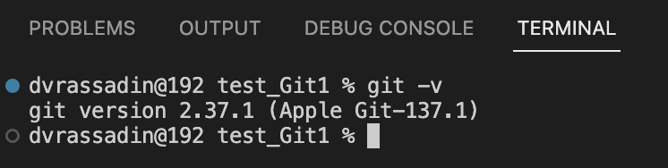
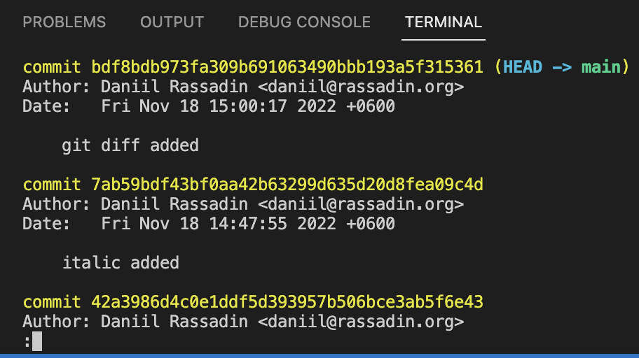
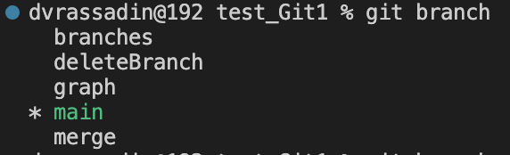

# Инструкция по работе с [Git](https://www.google.com/url?sa=t&rct=j&q=&esrc=s&source=web&cd=&cad=rja&uact=8&ved=2ahUKEwje-5LJtbf7AhXWS2wGHajLByYQFnoECAoQAQ&url=https%3A%2F%2Fru.wikipedia.org%2Fwiki%2FGit&usg=AOvVaw1U_V78UPALBvFXvbo-H8yP)

Инструкция по установке есть на [официальном сайте](https://git-scm.com).

### Чтобы убедиться что Git установлен можно ввести в терминале команду **git -v**:

### Чтобы создать репозиторий мы используем комманду:
> **git init** — это инициализация репозитория

### Чтобы посмотреть есть ли что сохранить в репозиторий нужно набрать комманду:

> **git status**

### Чтобы добавить изменнённые файлы в зону сохранения, мы используем комманды:

> * **git add .** — добавление всех файлов в Вашем репозитории
> * **git add *filename*** — добавление одного файла с именем *filename*

### Чтобы посмотреть разницу между добавленным файлом и последним сохранённым используем комманду:

> **git diff**

### Чтобы сохранить добавленные файлы надо набрать в терминале комманду git commit и комментарий к сохранению:

> **git commit -m "*комментарий*"**

### Коммандой **git log** можно посмотреть список всех коммитов:

Жёлтым выделены имя коммита (hash value)

### Чтобы перейти к более старой версии файла надо набрать комманду git checkout и указать имя коммита:

> **git checkout bb912ebf9ae5a6005050b8ced05f165a45117b0b**

### Чтобы вернуться к последнему коммиту можно набрать комманду **git checkout** и название ветки:

> **git checkout main**

### Чтобы посмотреть список веток, используется комманда:

> **git branch**

Звёздочкой выделена текущая ветка:

### Чтобы создать ветку мы используем комманду branch и указываем имя _создаваемой ветки_:

> **git branch _branchName_**

### Чтобы увидеть графическое отображение веток и их слияния можно использовать команд **git log** с флагом **graph**:

> **git log --graph**

### Чтобы слить изменения из одной ветки в другую, сначала надо перейти в ветку, в которую будут сливаться изменения и ввести команду с указанием _имени ветки_, из которой будут браться изменения:

> **git merge _branch_name_**

### Чтобы удалить ветку, мы используем комманду **branch** с флагом **-d** и указанием _имени ветки_:

> **git branch -d _branch_name_**

### Чтобы скопировать удалёный репозиторий на свой ПК, используем комманду **clone** с указанием *ссылки на удалённый репозиторий*:

> **git clone *URL***

### После очередного коммита можно отправить изменения на удалённый репозиторий с помощью команды:

> **git push**

### Чтобы скачать изменения с удалённого репозитория используется команда:

> **git pull**